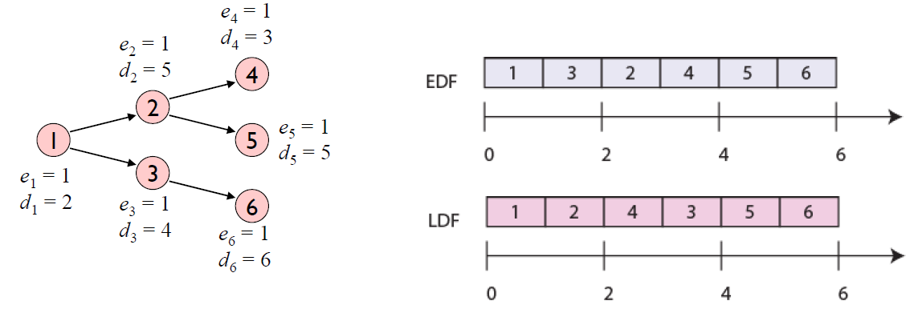
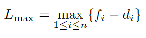

# Scheduling Algorithms

This document explains the four scheduling algorithms to be implemented in this project. It guides how to use these algorithms with a JSON logical model of jobs, messages, and nodes.

## Overview

The scheduling algorithms covered are:
1. Latest Deadline First (LDF) for Multi-Node
2. Earliest Deadline First (EDF) for Multi-Node
3. Latest Deadline First (LDF) for Single-Node
4. Earliest Deadline First (EDF) for Single-Node

## JSON Logical Model

The JSON logical model consists of:
- **Tasks**: Represent the tasks to be scheduled.
- **Messages**: Represent dependencies between jobs.
- **Nodes**: Represent the processors or cores where jobs can be executed or the switches and routers in the network.
- **Links**: Represent the communication links between tasks and has the bandwidth and latency information.

Note the units of time are arbitrary but same across all properties.

### Example JSON Model

```json
{
  "application": {
    "tasks": [
      {
        "id": "1",
        "wcet": 5,
        "mcet": 3,
        "deadline": 10
      },
      {
        "id": "2",
        "wcet": 3,
        "mcet": 2,
        "deadline": 25
      },
      {
        "id": "3",
        "wcet": 3,
        "mcet": 2,
        "deadline": 25
      },
      {
        "id": "4",
        "wcet": 3,
        "mcet": 2,
        "deadline": 25
      },
      {
        "id": "5",
        "wcet": 3,
        "mcet": 2,
        "deadline": 25
      },
      {
        "id": "6",
        "wcet": 3,
        "mcet": 2,
        "deadline": 25
      }
    ],
    "messages": [
      {
        "id": 1,
        "sender": 1,
        "receiver": 2,
        "size": 2,
      },
      {
        "id": 2,
        "sender": 1,
        "receiver": 3,
        "size": 2,
      },
      {
        "id": 3,
        "sender": 2,
        "receiver": 4,
        "size": 2,
      }
    ]
  },
  "platform": {
    "nodes": [
      {
        "id": 1,
        "type": "compute"
      },
      {
        "id": 2,
        "type": "compute"
      }
    ],
        }
    "links": [
	    {
      "id": 1,  
		  "start_node": 1,
		  "end_node": 2,
      "link_delay": 2,
      "bandwidth": 100,
      "type": "ethernet",
	    }
    ]

}
```
### Example Scheduling Algorithms Output
Given the example JSON model, the output of scheduling algorithms should be as follows:

``` json
{
    "schedule": [
        {
            "task_id": "1",
            "node_id": "1",
            "start_time": 1,
            "end_time": 5,
            "deadline": 2
        },
        {
            "task_id": 2,
            "node_id": 1,
            "start_time": 1,
            "end_time": 10,
            "deadline": 4
        },
        {
            "task_id": 3,
            "node_id": 1,
            "start_time": 1,
            "end_time": 10,
            "deadline": 5
        },
        {
            "task_id": 4,
            "node_id": 1,
            "start_time": 1,
            "end_time": 10,
            "deadline": 3
        },
        {
            "task_id": 5,
            "node_id": 1,
            "start_time": 1,
            "end_time": 10,
            "deadline": 5
        },
        {
            "task_id": 6,
            "node_id": 1,
            "start_time": 1,
            "end_time": 10,
            "deadline": 6
        }

    ]
}
```

## EDF and LDF for Single-Node

The Earliest Deadline First (EDF) and Latest Deadline First (LDF) algorithms for single-node systems schedules jobs similarly to the multi-node version but considers only one processor.

*Figure 1: The LDF scheduling strategy in single node, the task with the latest deadline to be scheduled last, and work backwards.  In EDF, the task with the closest deadline is scheduled first.*
### EDF for Single Node 
Analyzing the order of tasks in the Figure 1, Task 1 must be completed first because it is the starting task with no dependencies. Following Task 1, the next tasks to consider based on available dependencies are Tasks 3 and 2. Task 3 (d<sub>3</sub>=4) has an earlier deadline than task 2 (d<sub>2</sub>=5). Task 2 is scheduled after Task 3 as the next available task with the next closest deadline. Task 4 can only be scheduled after Task 2 is complete due to the dependency, even though Task 4 has an earlier deadline (d<sub>4</sub>=3) than task 2, its start is contingent on Task 2's completion. Tasks 5 and 6 follow based on their deadlines, d<sub>5</sub>=5 and d<sub>6</sub>=6, and dependencies.

### Usage

``` PYTHON
schedule = edf_single_node(application_data, platform_data)
``` 
### Example
``` json
{
    "schedule": [
        {
            "task_id": "1",
            "node_id": "1",
            "start_time": 1,
            "end_time": 5,
            "deadline": 2
        },
        {
            "task_id": 3,
            "node_id": 1,
            "start_time": 1,
            "end_time": 10,
            "deadline": 4
        },
        {
            "task_id": 2,
            "node_id": 1,
            "start_time": 1,
            "end_time": 10,
            "deadline": 5
        },
        {
            "task_id": 4,
            "node_id": 1,
            "start_time": 1,
            "end_time": 10,
            "deadline": 3
        },
        {
            "task_id": 5,
            "node_id": 1,
            "start_time": 1,
            "end_time": 10,
            "deadline": 5
        },
        {
            "task_id": 6,
            "node_id": 1,
            "start_time": 1,
            "end_time": 10,
            "deadline": 6
        }

    ]
}
```
### LDF for Single Node
From the figure 1, Task 1 must be completed first because it is the starting task with no dependencies. Following Task 1, the next tasks to consider based on available dependencies are Tasks 3 and 2. Task 2 (d<sub>2</sub>=5) has the latest deadline than task 3 (d<sub>3</sub>=4). Task 4 can only be scheduled after Task 2 is complete. As the deadline for task 3 is d<sub>3</sub>=4 and task 4 is d<sub>4</sub>=3  . Tasks 5 and 6 follow based on their deadlines, d<sub>5</sub>=5 and d<sub>6</sub>=6, and dependencies.


### Usage

``` PYTHON
schedule = ldf_single_node(application_data, platform_data)
```
### Example
```  json
{
    "schedule": [
        {
            "task_id": "1",
            "node_id": "1",
            "start_time": 1,
            "end_time": 5,
            "deadline": 2
        },
        {
            "task_id": 2,
            "node_id": 1,
            "start_time": 1,
            "end_time": 10,
            "deadline": 5
        },
        {
            "task_id": 4,
            "node_id": 2,
            "start_time": 1,
            "end_time": 10,
            "deadline": 3
        },
        {
            "job_id": 3,
            "node_id": 1,
            "start_time": 1,
            "end_time": 10,
            "deadline": 4
        },
        {
            "job_id": 5,
            "node_id": 1,
            "start_time": 1,
            "end_time": 10,
            "deadline": 5
        },
        {
            "job_id": 6,
            "node_id": 1,
            "start_time": 1,
            "end_time": 10,
            "deadline": 6
        }

    ]
}
```

## Earliest Deadline First (EDF) for Multi-Node

The Earliest Deadline First (EDF) algorithm schedules jobs based on the earliest deadlines. 
It prioritizes jobs with the nearest deadlines to ensure that all deadlines are met as soon as possible. EDF scheduling gives priority to tasks based on the imminence of their deadlines.  The task with the closest deadline is scheduled first.  Given n independent processes with deadlines, d1, . . . , dn, schedule them to minimize the maximum lateness, defined by the following equation,
                                    



where f<sub>i</sub> is the finishing time of process 'i'.  Note that the above equation is negative if all deadlines are  met. EDF  is  widely  used  in  systems  where  meeting  deadlines  is  crucial,  such  as  in multimedia systems for audio/video processing to ensure smooth streaming without delays. Assume we have at least three nodes. Node 1 might start with Task 1 (earliest starting task with no dependencies). As soon as Task 1 completes, Node 1 can take on Task 3, and Node 2 can begin Task 2 simultaneously since these tasks are now available and have the next earliest deadlines. Task 4 must wait for Task 2 to complete but could be started immediately on Node 3 if Task 2 finishes before Task 3. Task 5 and Task 6 would then be allocated based on their completion of dependencies.


### Usage

``` PYTHON
schedule = edf_multinode(application_data, platform_data)
```
### Example
``` json
{
    "schedule": [
        {
            "task_id": "1",
            "node_id": "1",
            "start_time": 1,
            "end_time": 5,
            "deadline": 2
        },
        {
            "task_id": 3,
            "node_id": 2,
            "start_time": 1,
            "end_time": 10,
            "deadline": 4
        },
        {
            "task_id": 2,
            "node_id": 2,
            "start_time": 1,
            "end_time": 10,
            "deadline": 5
        },
        {
            "task_id": 4,
            "node_id": 2,
            "start_time": 1,
            "end_time": 10,
            "deadline": 3
        },
        {
            "task_id": 5,
            "node_id": 2,
            "start_time": 1,
            "end_time": 10,
            "deadline": 5
        },
        {
            "task_id": 6,
            "node_id": 2,
            "start_time": 1,
            "end_time": 10,
            "deadline": 6
        }

    ]
}
```

## Latest Deadline First (LDF) for Multi-Node

The Latest Deadline First (LDF) algorithm schedules tasks based on the latest deadlines. 
It aims to delay task execution as much as possible while still meeting deadlines, to allow more urgent tasks to execute first. Assume a system with 3 nodes, Node 1 starts with Task 1. Upon completion, if Node 2 and Node 3 are free, Task 2 and Task 3 can start simultaneously on different nodes, minimizing their laxity as they are now the most critical tasks available.
Task 4 can start on any node that becomes free first, preferably the one that finishes Task 2 to keep the flow of dependencies smooth. Task 5 and Task 6 would then be allocated based on their completion of dependencies.


### Usage

``` PYTHON
schedule = ldf_multinode(application_data, platform_data)
```
### Example
``` json
{
    "schedule": [
        {
            "task_id": "1",
            "node_id": "1",
            "start_time": 1,
            "end_time": 5,
            "deadline": 2
        },
        {
            "task_id": 2,
            "node_id": 2,
            "start_time": 1,
            "end_time": 10,
            "deadline": 5
        },
        {
            "task_id": 4,
            "node_id": 1,
            "start_time": 1,
            "end_time": 10,
            "deadline": 3
        },
        {
            "task_id": 3,
            "node_id": 2,
            "start_time": 1,
            "end_time": 10,
            "deadline": 4
        },
        {
            "task_id": 5,
            "node_id": 2,
            "start_time": 1,
            "end_time": 10,
            "deadline": 5
        },
        {
            "task_id": 6,
            "node_id": 2,
            "start_time": 1,
            "end_time": 10,
            "deadline": 6
        }

    ]
}
```

## Least Laxity

Laxity in scheduling algorithms is defined as the difference between a task’s deadline and the required CPU time to complete it.  This metric is crucial in dynamic preemptive scheduling where priorities are  adjusted dynamically based on current  task states and requirements. The task with the least laxity gets  the  highest  priority.  
In figure 1, after Task 1, both Task 2 and Task 3 are ready for execution. At time 1, laxity of task  2 is $d_2 - e_2 = 5-1 = 3$. Laxity of task 3 is $d_3 - e_3 = 4-1 = 2$. Task 3 is selected as it has least laxity followed by task 2. Task 4, which depends on Task 2, can now start. Laxity of Task 4 at time 2 is $d_4 - e_4 = 3-1 = 2 $. With the lowest possible laxity, Task 4 gets scheduled immediately after Task 2, completing at time 3. Task 3 can now be executed, followed by Tasks 5 and 6. Their scheduling is straightforward as there are no remaining dependencies that affect their execution.
### Usage

``` PYTHON
schedule = ll_multinode(application_data, platform_data)
```
### Example
``` json
{
    "schedule": [
        {
            "task_id": "1",
            "node_id": "1",
            "start_time": 1,
            "end_time": 5,
            "deadline": 2
        },
        {
            "task_id": 3,
            "node_id": 2,
            "start_time": 1,
            "end_time": 10,
            "deadline": 4
        },
        {
            "task_id": 2,
            "node_id": 2,
            "start_time": 1,
            "end_time": 10,
            "deadline": 5
        },
        {
            "task_id": 4,
            "node_id": 1,
            "start_time": 1,
            "end_time": 10,
            "deadline": 3
        },
        {
            "task_id": 5,
            "node_id": 2,
            "start_time": 1,
            "end_time": 10,
            "deadline": 5
        },
        {
            "task_id": 6,
            "node_id": 2,
            "start_time": 1,
            "end_time": 10,
            "deadline": 6
        }

    ]
}
```
