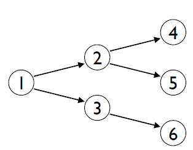
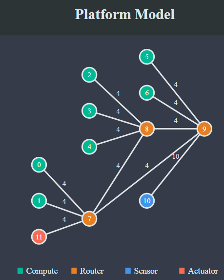

# Lab 2 - Scheduling algorithms for Real Time Systems

## Introduction

Scheduling algorithms are of fundamental importance to the functioning of real-time embedded systems, which are integral to numerous critical applications, including automotive safety systems to healthcare monitoring devices. These systems rely on precise timing and immediate response to external events to function correctly and efficiently. The role of scheduling algorithms is to manage the execution priorities of tasks in a way that optimizes performance and ensures timely task completion. Inadequate scheduling can result in missed deadlines, system overloads, and failures, which in safety-critical systems could have severe consequences. 

Therefore, the application of effective scheduling algorithms is crucial for enhancing system reliability and overall performance. By ensuring that system resources are allocated efficiently and tasks are completed within their time constraints, scheduling algorithms help maintain the integrity and reliability of embedded systems.

*Figure 1: A pool of tasks completed based on scheduling*

## Objective

The primary goal outlined in this task sheet is to design and implement various scheduling algorithms within the context of real-time systems.  The visualization frontend will serve as an educational tool,providing visual insights into how different algorithms schedule tasks. You will be able to interact with the application to modify task parameters, compare the outcomes of different scheduling algorithms,and gain a deeper understanding of their advantages and limitations in real-world scenarios.

## Background 

### Directed Acyclic Graphs (DAGs)
Directed Acyclic Graph (DAG) is an incredibly valuable tool for representing and managing the relationships and dependencies among various tasks or jobs that need to be scheduled. In such graphs, each node represents a task, and the directed edges between these nodes indicate the precedence relationships, meaning that one task must be completed before another can begin. 

In DAGs used for scheduling, each node represents an individual task or job. These tasks often have associated attributes like duration, resource requirements, or deadlines. The directed edges between the nodes represent the precedence constraints. An edge from node A to node B implies that task A must be completed before task B can start. This directionality is critical for ensuring tasks are performed in the correct order. The acyclic property of DAGs is crucial in scheduling because it guarantees that there are no circular dependencies, which would make scheduling impossible. In practical terms, this means there can be no situation where task A depends on task B, while task B simultaneously depends on task A, either directly or indirectly.

*Figure 2: A directed acyclic graph (DAG) shows precedences, showing that process 1 must complete before processes 2 and 3 can be started, etc.*

### Application and Platform Models
The application model defines how different tasks in a system interact and communicate with each other. It includes the properties of tasks and the messages that are exchanged between them. The tasks are represented by nodes and in the Figure 2, nodes 1, 2, 3, 4, 5 and 6 indicate tasks. The arrows indicate the direction of communication, where one task sends a message to another task. 

The platform model represents the hardware and communication infrastructure of an embedded system. It includes nodes (such as compute units, routers, sensors, and actuators) and links that connect these nodes.

In the Figure 3, the arrows between the nodes represent the communication links, with the numbers next to links indicating the link delay. Here we assume, that communication link can only exit between a router and other node which can either be compute node, sensor, actuator or another router. 

Figure 3: Platform model

In multi-node scheduling, the tasks can be distributed across different compute nodes. The tasks can be scheduled on different compute nodes based on the availability of the compute nodes and the communication delays between the nodes. However, the tasks should be scheduled in such a way that the precedence constraints are maintained. The communication delays between the nodes should be considered while scheduling the tasks. The communication delays should be added to the execution time of the tasks while calculating the completion time of the tasks. The tasks should be scheduled in such a way all tasks meettheir deadline.

## Tasks

  - Implement the following [scheduling algorithms](scheduling_algorithms.md) as outlined in [to-do list](todo.rst). These algorithms should take json inputs describing the platform model and application model, the input json conforming to the JSON schema defined in the [input json schema](README.md#api-input-schema-for-schedule-jobs). They should produce a schedule output that adheres to the JSON schema defined in the [output json schema](README.md#output-schema-for-schedule-jobs).
    - Latest Deadline First Single Node (LDF).
    - Earliest Deadline First Single Node (EDF).
    - Least Laxity Multi Node (LLF).
    - Latest Deadline First Multi Node.
    - Earliest Deadline First Multi Node.

- For this lab, you can ignore the link delay and bandwidth fields in the platform model. You can assume that the communication between the nodes is instantaneous and there is no bandwidth constraint, and all nodes are connected to a single router. However, as a bonus, you are encouraged to consider the link delays and communication paths as defined in the platform model.

 ## Documentation and Reporting

 As you test and optimize, document your findings.  Note down what worked, what did not,and how you adjusted your approach. This documentation will be invaluable for your final report and provides a clear record of your problem solving process. Testing and optimization are as much a part of the learning process as the initial development. They provide insight into the practical challenges and the importance of iterative design.

 ### Documenting Code

 - **Code Comments**:Include comprehensive comments throughout your python code.  Explain the purpose of functions, logic behind critical sections, and meanings of key variables.Use inline comments for complex lines of code to clarify their functionality.
 - **Readable  Structure**:Organize  your  code  logically.   Group  related  functionalities  intofunctions  or  classes  and  use  clear,  descriptive  names  for  variables  and  functions.   Ensureyour script follows a consistent coding style for ease of reading and maintenance.

 ### Writing Lab Report
Use the cover sheet template/report template provided by in moodle.
- Only the title page should show the logos in the header
- Use proper paper geometry, e.g., margins: right, left, top 2.5 cm, bottom 2 cm.
- Font size 11-12, line spacing between 1.15 and 1.5.

#### Goal of the report:
- The report summarizes and presents your work on the exercises and answers all given questions from the task sheets
- Use proper line of arguments
- In a step by step procedure, the report introduces the task, raises the questions, shows the solutions (including necessary intermediate results) and makes conclusions
- Readers (e.g., other students, supervisors and the professor) who have not attended the course and do not know about any implementations must be able to understand the report.

#### In the report

- Use meaningful heading for different sections (headings should be numbered and larger than the text, not bold and not underlined)
- Use table of contents (and list of figures)
- Number the pages
- When answering the questions, number and repeat the questions before providing answers below each corresponding question.

##### When presenting a plot or a figure
- Carefully decide, what you intend to show/highlight/demonstrate with the figure
- Introduce the figure with direct referencing in the text (e.g., Figure 1 shows …)
- Center the figure horizontally
- Label the figure
- Label the axes (description and unit), appropriate font size
- Use a grid if necessary
- Use multiple colors or types for different lines within a plot
- Use a legend if necessary
- Describe plots and figures in detail, especially focus on the signal characteristics
- Provide explanations for your plot descriptions
- Make conclusions from the plot
- Figures and tables should be upright if possible, so that the reader does not need to rotate the page
- Use appropriate file formats for figures (e.g. latex: eps, pdf, svg; word: emf, wmf, svg, (large scaled png))

##### When presenting a formula/equation
Use proper visualization, e.g., in MS Word use the equation editor (insert -> equation) or use the LaTeX equation option
- Center equations horizontally
- Number the equation
- Use only symbols in equations and no written words
- Explain all used symbols in the text after the equation. The symbols should have the same font and should not look different (compare: 𝛽 and β).

##### Hand in the report and all necessary working files

- Check for grammar and spelling mistakes before submission.
- The report should be a single document file covering the complete exercise.
- Provide commented programming code/modeling files along with your report (.py files).
- The programs must run without errors.
- Prepare zipped archive (.zip, .rar, .7z, etc.) containing all working files and the report
- Upload the zipped archive to the moodle platform.

 ## Deliverables

 - algorithms.py file with scheduling algorithm implemented.
 - Lab report in pdf format.

 ## Evaluation Criterion

 - Well-structured and logically organized code.
 - Comprehensive comments explaining the purpose and logic of the code.
 - Quality of the report.

